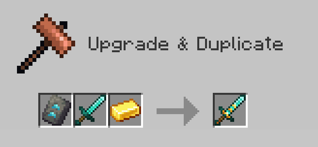
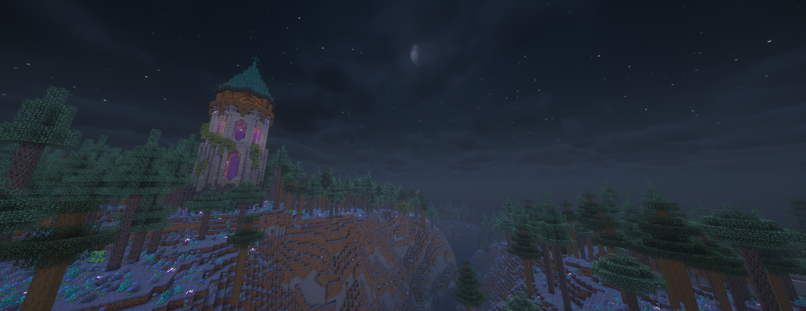
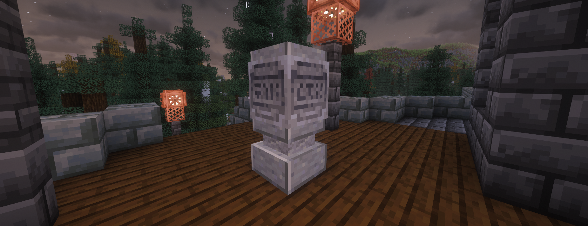
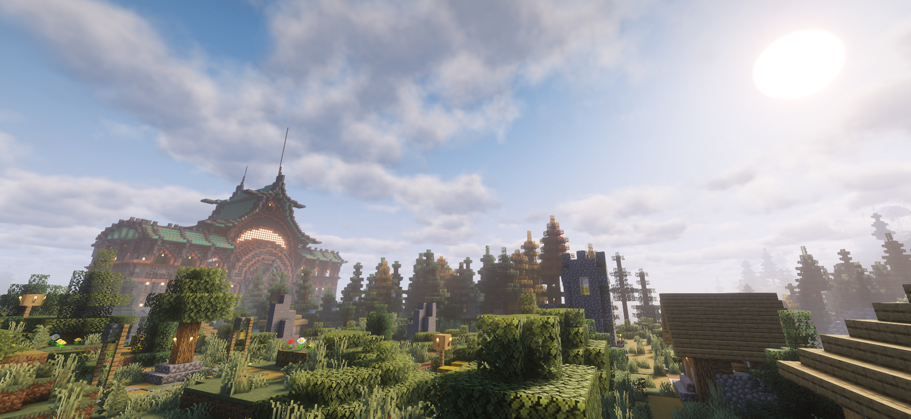
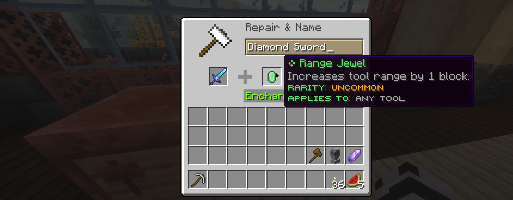
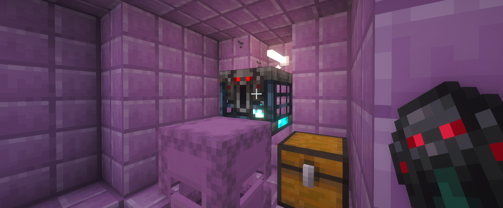

Hi all, it's a brand new year and we've got some news to share about the future of ATC!

It's been over two years since we revived ATC and we've been super happy to see how many faces new and old have joined us. I'm incredibly shocked at just how many people still have fond memories of the old server and it's humbling to see how many friendships formed there that have persisted all this time.

We've put a lot of energy, time and resources into making the new ATC server so it's a difficult thing to recognise but myself and the other staff team members have agreed it's time to turn the page. When we started out we had a lot of ambition that we weren't able to deliver on, for one reason or another. The survival server has an enormous amount of custom content that has made it extremely difficult to move up to newer versions of the game, as well as many unfinished plans and features that would only make the problem worse.

However, we don't just want to shut the server down with nothing to replace it, so I'm pleased to announce the creation of a new vanilla+ survival multiplayer server! We've been hard at work setting up a brand new world that is almost ready to open. We've massively cut down the amount of custom content with a focus on the core minecraft experience.

#### ATC Vanilla+

So what can you expect from the new server?

First off, we've removed a number of our traditional plugins and features - there is no McMMO, no geodes, no guilds or towns, and no `/home` or `/tpa`. Instead you'll be getting a vanilla-like minecraft experience that doesn't provide the usual comforts that eliminate a lot of gameplay. This not only helps to make the gameplay richer, but also massively reduces the overhead that should hopefully let us bump the server to new versions quickly when they come out, as Mojang releases new versions much more regularly than they used to. The server will be on 1.21.11 to start with and we plan to continue upgrading it to new versions as they come out. 

Our creative mode server will remain accessible with the same world and we plan to have that upgraded to a newer minecraft version also.

#### New Terrain

The new server uses the Terralith datapack to create a much more vibrant and detailed world with almost 100 biomes to explore. The world is on "normal" difficulty. The nether and end remain unchanged from vanilla.

#### Death

Replacing the old Graves system we've added a custom death mechanic that will cause you to drop only the items in your main inventory and your experience. This means when you die you will keep your armor, hotbar, and offhand items, but will have to go back to collect any other items and experience. We've also enabled instant respawn.

#### Getting Around

Now you can't just teleport home or to each other directly, you'll be relying on more traditional modes of transportation such as minecarts, horses, or some less traditional ones (happy ghasts).

We have added a new waystone block which can be crafted by players, but the recipe will be a little expensive, and players will have to have discovered a waystone before they can teleport to it. You can get a cheap waystone for a diamond from the spawn, one per player.

You will be able to use `/spawn` to get back to spawn at any time, and can use the waystone there to get back to any other waystones you have already unlocked.

#### Economy

We've added a new shop plugin that does not rely on virtual currency and instead uses item bartering. You can find a tutorial on how to make those at the new server spawn. 

For convenience we've added a new "Coin" item, that can be exchanged for nether stars at spawn. Coins come in 3 denominations, worth 1 nether star, 1/64th of a nether star and 1/4096th of a nether star. You will be able to split and combine coins between the denominations as you like using commands. e.g. 64 "Copper Dregs" are worth 1 "Silver Earl", and 64 "Silver Earl" is worth 1 "Golden Caddy". Golden Caddys can be exchanged for nether stars and vice versa at the spawn bank.

To kickstart the economy you will be able to acquire some coins in exchange for diamonds, but these will be limited and long term you will only be able to convert coins into nether stars and back.

More detail on this feature can be found at the Bank at server spawn.

#### Tools and Weapons

We've also added a Tool Trims datapack allowing you to customise the look of your tools and weapons in a similar way to Armor Trims. You can find the new trim items in regular loot chests. You can also rename your items in an anvil using color codes e.g. "&bMy Tool" or "<#d98be8>My Tool".

Another new feature is the addition of various Socket Jewels. These add additional bonuses to your tools such as vein mining on pickaxes, additional damage for swords, or chopping down whole trees for axes and more. Socket Jewels are rare, and getting the best ones will require exploring the most difficult areas of the game. We'll put another post up around the different ways you can acquire them soon. You'll also need to find a base tool with a socket slot on it to be able to apply a socket. These spawn in loot chests and vaults in all worlds.

#### The End

Accessing the end will be more difficult than usual, as we have changed the recipe for ender eyes to require more materials. In addition to the ender pearl and blaze powder, the recipe calls for a wind charge, a prismarine shard and an echo shard, requiring you to explore additional structures before you can access it. The Ender Dragon has also been buffed to make it more of a challenge and will drop a Dragon Egg every time it is defeated.

Once you get past the ender dragon, we've made a small adjustment to the End City structures - the usual Item Frame containing an Elytra is now replaced with an Ominous Vault that will require an Ominous Trial Key to open. This allows for each player that discovers a city to get access to their own Elytra rather than them being only available to the first person who discovers them. Make sure to stock up on Ominous Vault keys before you go exploring the end!

#### Voice Chat

The server now supports the Simple Voice Chat mod, so anyone who has that mod installed will be able to chat in-game to each other. Simple Voice Chat is a proximity based system but you will be able to create private groups that can be used to chat long distance.

### When?

The new ATC server will open on Saturday the 17th of January! The server will be unavailable between 10:00am and 2:00pm GMT while we make changes, after which you'll be able to join and play the new Vanilla+ server! The old survival server will still be accessible for a week after this with a farewell night on Friday the 23rd, when we'll shut the old server down.